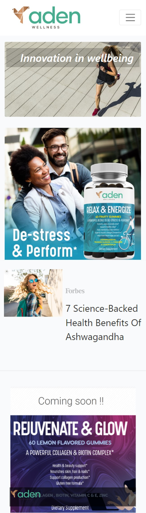
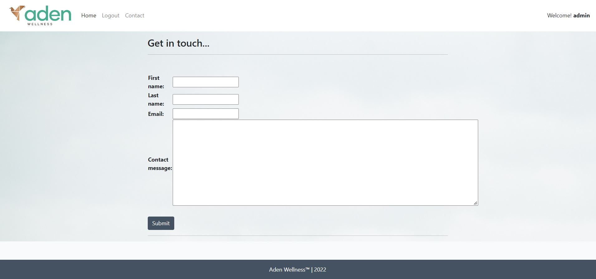

# Welcome!


This digitalz-aden application is a real-life prototype destined to replace the current adenwell.com website.
Aden Wellness is a brand of wellness products (supplements, essential oils,..) that is starting its activities with launching several products on Amazon USA. To promote their philosophy of business, present products, direct users to e-commerce or Amazon site they need an interactive website with an ability to offer users to comment and post their own ideas. 

Therefore, the app has 2 distinctive parts:
1.	Top part is the content selection of more permanent materials that are managed by the company (admin, UserAdmins)
2.	Then blog/ad area - where the announcements, promotions, thoughts (including third parties) are displayed. It includes more interactivity with likes & comments.  

The working version of the Digitals-AdenWell app can be found [here](https://digitalz-adenwell.herokuapp.com)


## Table of Contents

- [Welcome!](#welcome)
  - [Table of Contents](#table-of-contents)
  - [User Experience (UX)](#user-experience-ux)
    - [Strategy](#strategy)
      - [Flexibility \& Impact](#flexibility--impact)
      - [Security](#security)
      - [User Stories - usage](#user-stories---usage)
      - [User Stories - creation](#user-stories---creation)
      - [Things, left "for next Iteration"](#things-left-for-next-iteration)
    - [Stages](#stages)
      - [Ideation, prioritization and planning](#ideation-prioritization-and-planning)
      - [Database Models](#database-models)
    - [Surface](#surface)
      - [Color Scheme](#color-scheme)
      - [Typography](#typography)
  - [Features - Finished Product](#features---finished-product)
    - [General](#general)
  - [Technologies Used](#technologies-used)
    - [Languages Used](#languages-used)
    - [Libraries and Frameworks](#libraries-and-frameworks)
    - [Packages / Dependecies Installed](#packages--dependecies-installed)
    - [Database Management](#database-management)
    - [Tools and Programs](#tools-and-programs)
  - [Testing](#testing)
  - [Deployment](#deployment)
    - [Deploying on Heroku](#deploying-on-heroku)
    - [Forking the Repository](#forking-the-repository)
    - [Creating a Clone](#creating-a-clone)
  - [Finished Product](#finished-product)
  - [Credits](#credits)
    - [Content](#content)
    - [Media](#media)
    - [Code](#code)
  - [Known Bugs](#known-bugs)
  - [Acknowledgements](#acknowledgements)


***


## User Experience (UX)

### Strategy

In effect, Digitalz-Adenwell is a business presentation and customer engagement application with full content creation and management functionality from the front-end, strictly following the user admin rights (although everything can be altered and overwritten from the admin-backend too).

#### Flexibility & Impact

* All content except of navbars can be created/updated or deleted by user from the front-end or admin module

* Most of the fields support text & images.

* ALT text can be created directly in the content form for higher searchability of the content

* User can choose between layout options and how many items to put on one row on the screen

* User can set the specific place for a specific content by assigning the content-order number 

* User can set-up the height of the elements for larger screens.

* User can create draft content and access it later to publish/update or delete

* Structure is easy to understand and navigates effortlessly.


#### Security

* Site users are able to register an account in order to interact with the content.

* User can't select the author, he is author by default.

* Update/Delete content/post are not accessible via browser if you are not the author.

* Users can update/delete only the posts/content they have created.

* Users can't make a draft of the Post - to keep the system and database cleaner.


#### User Stories - usage

1.	As a **Site User** I can **register an account** so that **I can comment and like**
2.	As a **Site User** I can **view a list of posts** so that **I can select one to read**
3.	As a **Site User** I can **click on a post** so that **I can read the full text**
4.	As a **Site User** I can **leave comments on a post** so that **I can be involved in the conversation**
5.	As a **Site User** I can **like or unlike a post** so that **I can interact with the content**
6.	As a **Site User** I can **click on a content** so that **I can read more about the topic**
7.	As a **User / Admin** I can **view the number of likes on each post** so that **I can see which is the most popular or viral**
8.	As a **User / Admin** I can **view comments on an individual post** so that **I can read the conversation**


#### User Stories - creation

9.	As a **User-admin** I can **create, edit, and delete a) content & b) posts directly on app** so that **I can manage the content area without accessing admin module**
10.	As an **Admin** I can **create draft content** so that **I can publish/ update or delete later** 
11.	As an **Admin** I can **approve or disapprove comments** so that **I can filter out objectionable comments**
12.	As an **Admin** I can **set the content width** so that **I can place different number of items on one row**
13.	As a **Site Admin** I can **assign the post position number**, so **I can place posts according to importance** 
14.	As an **Admin** I can **select the card height** so that **I can create better looking design**
15.	As an **Admin** I can **select the card template** so that **I can create dynamic looking design**
16.	As a **User** I can **create a contact message** so that **I can express my opinion or ask to contact back**

  

#### Things, left "for next Iteration"

* As a **Site Admin** I can **set the publishing and validity date (&time) of the content** so that **I can manage content appearance**.

* As a **Site Admin** I can **set the end date for the post** after which it moves to 'draft' status so that **I can keep the site cleaner**.
  
* Social media sign-up


### Stages
[Go to the top](#table-of-contents)

The Planning & Execution of DigitalZ-Aden project was in 4 distinct phases: 

#### Ideation, prioritization and planning

The current webdesign of AdenWellness [here](https://adenwell.com/) was reviewed and discussed, what would be the 'wishes' for the new design:

* Responsive design

* Header, footer and navigation bar are consistent through all pages.

* Account registration

* Create, edit and delete content from fron-ent, not only from admin module

* Separate permanent content from the promotional materials and posts

* Ability to interact with users via comments and contact messages

* Ability to create interesting and varied content without other tools (editors, design tools)

* No link (at the moment) to external sorces : Amazon, e-commerce, etc.


As a outcome - simple sketch of structure was drawn and defined **3 phases** of the software development. 

* **!** - content is created by the user either by upload of image or made using CRUD functionality & Summernote directly from the front-end.


* 3 phases of software development were defined as projects with unique User Stories and Tasks


GitHub projects was used as my project management tool to track user stories. Using a Kanban board helped to focus on specific tasks and track the project progress.

**Second Phase**

Second phase was to create the full CRUD functionality for 'blog-posts' that in real life would serve as promotional, informational pieces. 

* Create, read, update and delete posts as author
* Leave comment
* Like/Unlike the post


**Third Phase**

Third phase was to create the full CRUD functionality for 'content' pieces that in real life would serve as company's representative area. 

* Create, read, update and delete content as author
* Create variety of designs through multiple Summernote fields
* Manage drafts
* Change placement, size and template of the content 


**Fourth Phase**

To make sure most relevant testing is performed, Fourth phase was to create to list the testing and deployment tasks. 

* User Stories testing
* Manual testing
* W3C HTML CSS, PEP8, JSHints, Lighthouse
* TestCase automated
* Security testing
* Deployment to Heroku


#### Database Models

The database model has been designed and managed using [PostgreSQL](https://www.postgresql.org/).

1. **POST Model**

* title = models.CharField()
* slug = models.SlugField()
* author = models.ForeignKey(User)
* posted_by = models.TextField()
* order = models.IntegerField(**defines the place in relation to other posts**)
* featured_image = CloudinaryField()
* excerpt = models.TextField()
* updated_on = models.DateField()
* content = models.TextField()
* created_on = models.DateField()
* status = models.IntegerField()
* likes = models.ManyToManyField()


2. **Comment Model**

* post = models.ForeignKey(Post)
* name = models.CharField()
* email = models.EmailField()
* body = models.TextField()
* created_on = models.DateTimeField()
* approved = models.BooleanField(default=False)


3. **HeroContent Model**

* hero_title = models.CharField()
* slug = models.SlugField()
* author = models.ForeignKey(User)
* hero_featured_image = CloudinaryField()
* image_alt_text = models.CharField(**text automatically placed in html to increase accessibility**)
* hero_header = models.CharField(**summernote field that creates higher impact than title**)
* text_background = models.IntegerField(**shade of grey to increase the header text visibility on light images**)
* hero_excerpt = models.TextField()
* images_on_desktop = models.IntegerField(**number of content cards user wants to see on 1 row on larger screens**)
* image_height = models.IntegerField(**The height of image in px user wants for images on large screens**)
* image_place = models.IntegerField(**defines image vs text relationship: image as background or on the side**)
* image_order = models.IntegerField(**defines the place in relation to other Content cards**)
* updated_on = models.DateTimeField()
* hero_content = models.TextField(**another summernote field**)
* created_on = models.DateTimeField()
* status = models.IntegerField()

!Many of the model fields have a selection option:

* STATUS = ((0, "Draft"), (1, "Published"))
* IMAGECOUNTMOBILE = ((12, "Whole Page"), (6, "2xPage"))
* IMAGECOUNTDESKTOP = ((12, "Whole Page"), (8, "2/3 of Page"),
                     (6, "Half of Page"), (4, "1/3 of Page"),
                     (3, "1/4 of Page"))
* IMAGEHEIGHT = ((40, "400px"), (32, "320px"), (27, "270px"), (20, "220px"),
               (16, "160px"), (8, "88px"), (5, "50px"))
* IMAGEPLACE = ((1, "Image-as-background"), (2, "Image-on-side"))
* TEXTBACKGROUND = ((1, "No background"), (2, "Put background"))


4. **ContactMessage Model**

* first_name = models.CharField()
* last_name = models.CharField()
* email = models.EmailField()
* contact_message = models.TextField()
* created_on = models.DateTimeField()


### Surface
[Go to the top](#table-of-contents)

#### Color Scheme


The colors used in the website respect the green-golden color-scheme of Aden Wellness, represented in the logo. 

Main colors in the application are achieved through images, so complementary slate-gray (#445261) and baby powder (#FFFFFD) were chosen just to create some contrast, improve readibility and maintain consistent look. 


#### Typography

The main font being used in the site is Segoe UI with occasional introduction of Roboto, with sans-serif as a fallback in case Segoe UI doesn't get imported correctly. 

Segoe UI was chosen after refresher-research on fonts that are better for reading, however Segoe UI has proven to be font-of-choice for a few years in app development.


## Features - Finished Product
[Go to the top](#table-of-contents)

### General

* The website has been designed from a mobile first perspective.

* Responsive design across all device sizes.

* Navigation Bar


    *  Contains the main logo, links and Welcome! with user name.


* Footer
  

    * The footer includes a logo and link to social media channels (hidden while waiting for Aden Wellness approval to use).


Page | Desktop | Mobile |
--- | --- | --- |
| Home |  |  |
| Content |  |  |
| Post |  |  |
| Contact | |  |
| Register | |  |
| Log-in | |  |
| Log-out |  |  |


## Technologies Used
[Go to the top](#table-of-contents)

### Languages Used

* [HTML5](https://en.wikipedia.org/wiki/HTML)
* [CSS3](https://en.wikipedia.org/wiki/CSS)
* [JavaScript](https://en.wikipedia.org/wiki/JavaScript)
* [Python](https://en.wikipedia.org/wiki/Python_(programming_language))


### Libraries and Frameworks

* [Django](https://www.djangoproject.com/)   
    * Django was used as web framework.

* [Django Template](https://jinja.palletsprojects.com)  
    * Django Template was used as a templating language for Django to display backend data to HTML.
   
* [Bootstrap 5](https://getbootstrap.com/docs/5.0/getting-started/introduction/)  
    * Bootstrap 5 was used throughout the website to help with styling and responsiveness.

* [Google Fonts](https://fonts.google.com)  
    * Google fonts was used to import the fonts into the html file, and were used on all parts of the site.

* [Font Awesome](https://fontawesome.com)  
    * Font Awesome was used throughout the website to add icons for aesthetic and UX purposes. 

* [jQuery 3.6.0](https://jquery.com/)  
    * jQuery was used as a JavaScript library to help writing less JavaScript code.  


### Packages / Dependecies Installed

* [Django Allauth](https://django-allauth.readthedocs.io/en/latest/)  
    * Django Allauth was used for user authentication, registration, and account management.

* [Django Crispy Form](https://django-crispy-forms.readthedocs.io/en/latest/)   
    * Django Crispy Form was used to control the rendering of the forms. 
 
* [Gunicorn](https://gunicorn.org/)  
    * Gunicorn was used as Python WSGI HTTP Server for UNIX to support the deployment of Django application.  

* [Summernote](https://summernote.org/) 
    * Summernote has been used as WYSIWYG editor.

* [Cloudinary](https://cloudinary.com/)
    * Cloudinary has been used as image management solution

### Database Management
* [Heroku Postgres](https://www.heroku.com/postgres)   
    * Heroku Postgres database was used in production, as a service based on PostgreSQL provided by Heroku.


### Tools and Programs

* [Git](https://git-scm.com)  
    * Git was used for version control by utilizing the Gitpod terminal to commit to Git and Push to GitHub. 

* [GitPod](https://gitpod.io/)
     * GitPod was used for writing code, committing, and then pushing to GitHub.

* [GitHub](https://github.com)  
   GitHub was used to store the projects code after being pushed from Git. 

* [Heroku](https://www.heroku.com)   
    * Heroku was used to deploy the website.

* [Am I Responsive](ami.responsivedesign.is)  
    * Am I Responsive was used to preview the website across a variety of popular devices.

* [Tiny PNG](https://tinypng.com)    
    * Tiny PNG was used to reduce the file size of the images.

* [Coolors](https://coolors.co)  
    * Coolors was used to create a color scheme for the website.

* [Balsamiq](https://balsamiq.com/)
     * Balsamiq was used to create the wireframes during the design phase of the project

* [Chrome DevTools](https://developer.chrome.com/docs/devtools/)
    * Chrome DevTools was used during development process for code review and to test responsiveness.

* [W3C Markup Validator](https://validator.w3.org/)
    * W3C Markup Validator was used to validate the HTML code.

* [W3C CSS Validator](https://jigsaw.w3.org/css-validator/)
    * W3C CSS Validator was used to validate the CSS code.

* [JSHint](https://jshint.com/) 
    * The JSHints JavaScript Code Quality Tool was used to validate the site's JavaScript code.

* [Favicon.cc](https://www.favicon.cc/) 
    * Favicon.cc was used to create the site favicon.


## Testing
[Go to the top](#table-of-contents)

The testing documentation can be found [here](https://github.com/Zilvaro/digitalz-adenblog/blob/main/TESTING.md#digitalz-adenblog-testing).


## Deployment

This project was developed using a [GitPod](https://gitpod.io/) workspace. The code was commited to [Git](https://git-scm.com/) and pushed to [GitHub](https://github.com/") using the terminal.

### Deploying on Heroku
To deploy this page to Heroku from its GitHub repository, the following steps were taken:

1. Create the Heroku App:
    - Select "Create new app" in Heroku.
    - Choose a name for your app and select the location.

2. Attach the Postgres database:
    - In the Resources tab, under add-ons, type in Postgres and select the Heroku Postgres option.

3. Prepare the environment and settings.py file:
    * In the Settings tab, click on Reveal Config Vars and copy the url next to DATABASE_URL.
    * In your GitPod workspace, create an env.py file in the main directory. 
    * Add the DATABASE_URL value and your chosen SECRET_KEY value to the env.py file.
    * Add the SECRET_KEY value to the Config Vars in Heroku.
    * Update the settings.py file to import the env file and add the SECRETKEY and DATABASE_URL file paths.
    * Update the Config Vars with the Cloudinary url, adding into the settings.py file also.
    * In settings.py add the following sections:
        * Cloudinary to the INSTALLED_APPS list
        * STATICFILE_STORAGE
        * STATICFILES_DIRS
        * STATIC_ROOT
        * MEDIA_URL
        * DEFAULT_FILE_STORAGE
        * TEMPLATES_DIR
        * Update DIRS in TEMPLATES with TEMPLATES_DIR
        * Update ALLOWED_HOSTS with ['app_name.heroku.com', 'localhost']

4. Store Static and Media files in Cloudinary and Deploy to Heroku:
    - Create three directories in the main directory; media, storage and templates.
    - Create a file named "Procfile" in the main directory and add the following:
        - web: gunicorn project-name.wsgi
    - Go to Deploy tab on Heroku and connect to the GitHub, then to the required recpository.
    Click on Delpoy Branch and wait for the build to load. When the build is complete, the app can be opened through Heroku.

### Forking the Repository
By forking the GitHub Repository we make a copy of the original repository on our GitHub account to view and/or make changes without affecting the original repository by using the following steps...

1. Log into [GitHub](https://github.com/login) or [create an account](https://github.com/join).
2. Locate the [GitHub Repository](https://github.com/josswe26/digitalz-aden).
3. At the top of the repository, on the right side of the page, select "Fork"
4. You should now have a copy of the original repository in your GitHub account.

### Creating a Clone
How to run this project locally:
1. Install the [GitPod Browser](https://www.gitpod.io/docs/browser-extension/ "Link to Gitpod Browser extension download") Extension for Chrome.
2. After installation, restart the browser.
3. Log into [GitHub](https://github.com/login "Link to GitHub login page") or [create an account](https://github.com/join "Link to GitHub create account page").
2. Locate the [GitHub Repository](https://github.com/josswe26/digitalz-aden).
5. Click the green "GitPod" button in the top right corner of the repository.
This will trigger a new gitPod workspace to be created from the code in github where you can work locally.

How to run this project within a local IDE, such as VSCode:

1. Log into [GitHub](https://github.com/login) or [create an account](https://github.com/join).
2. Locate the [GitHub Repository](https://github.com/josswe26/digitalz-aden).
3. Under the repository name, click "Clone or download".
4. In the Clone with HTTPs section, copy the clone URL for the repository.
5. In your local IDE open the terminal.
6. Change the current working directory to the location where you want the cloned directory to be made.
7. Type 'git clone', and then paste the URL you copied in Step 3.
```
git clone https://github.com/josswe26/digitalz-aden
```
8. Press Enter. Your local clone will be created.

Further reading and troubleshooting on cloning a repository from GitHub [here](https://docs.github.com/en/free-pro-team@latest/github/creating-cloning-and-archiving-repositories/cloning-a-repository)


## Finished Product
[Go to the top](#table-of-contents)

Page | Desktop | Mobile |
--- | --- | --- |
| Home |  |  |
| Content |  |  |
| Post |  |  |
| Contact | |  |
| Register | |  |
| Log-in | |  |
| Log-out |  |  |


## Credits
[Go to the top](#table-of-contents)

### Content

* Website content was written by the developer.
* Example images & some quotes were taken from [Aden Wellness](https://adenwell.com/)-

### Media

* [Pexels](https://www.pexels.com/)

    * About Page image: Taken by [Buro Millennial](https://www.pexels.com/@buro-millennial-636760/).

* [Unsplash](https://unsplash.com/)

    * 404 Error Page image: Taken by [Tai Bui](https://unsplash.com/@agforl24).

### Code

* [Stack Overflow](https://stackoverflow.com/) and [W3Schools](https://www.w3schools.com/) were consulted on a regular basis for inspiration and sometimes to be able to better understand the code being implement.

* Message implementation an dismissal code is taken from [Code Institute](https://codeinstitute.net/)'s django-blog project.


## Known Bugs

* Upvote/downvote button selection stay the same for all users. This do to an error in the logic. Even though the developer has an idea on how to solve the issue. The solution is yet to be implemented due lack of time.

* The same applies for pagination is Search Results page which is currently not working.

* A known issue with Summernote field validation is present in the project. An invalid form will be posted if the field is empty. A message will however be displayed, informing the user that there has been a problem with the submission.


## Acknowledgements

* My partner, for her unconditional love, help and continued support in all aspects of life, specially when I did not have time for anything else than to work with this project. You made it possible!

* My friend, Miguel, for being always there to help, no matter what time of the day.

* My tutor, Marcel, for his invaluable support, feedback and guidance through the whole process.

* Code Institute and its amazing Slack community for their support and providing me with the necessary knowledge to complete this project.

[Go to the top](#table-of-contents)