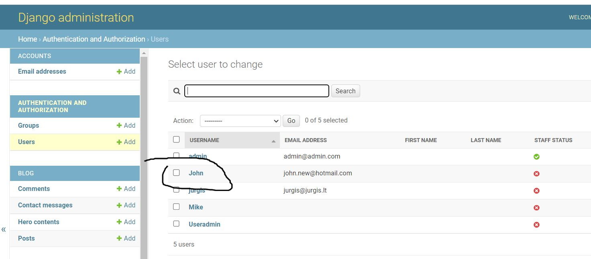

# DigitalZ Aden Testing

[Back to the README.md file](https://github.com/Zilvaro/digitalz-adenblog/blob/main/README.md)  

[Back to the Testing section in the README.md file](https://github.com/Zilvaro/digitalz-adenblog#testing)

[View the live website here](https://digitalz-adenwell.herokuapp.com/)  

## Table of Contents

1. [Testing User Stories](#testing-user-stories)
2. [Code Validation](#code-validation)
3. [Accessibility](#accessibility)
4. [Tools Testing](#tools-testing)
5. [Manual Testing](#manual-testing)
6. [Security Testing](#security-testing)
7. [Automated Testing](#automated-testing)


***


## Testing User Stories

### 1. As a **Site User** I can **register an account** so that **I can comment and like**

* A clear indication-link on the nav bar.


* Controlled form to fill-in data.


* Confirmation about signing-in and greeting.


* New-user data is visible and manageable in admin-backend.



### 2. As a **Site User** I can **view a list of posts** so that **I can select one to read**

* 


### 3. As a **Site User** I can **click on a post** so that **I can read the full text**

* 


### 4. As a **Site User** I can **leave comments on a post** so that **I can be involved in the conversation**

* Leave comment.


* Waiting-for-approval message.


* Read comment in the conversation stream.


### 5. As a **Site User** I can **like or unlike a post** so that **I can interact with the content**

* 'like' post.            


* 'unlike' post. 


### 6. As a **Site User** I can **click on a content** so that **I can read more about the topic**

* 


### 7. As a **User / Admin** I can **view the number of likes on each post** so that **I can see which is the most popular or viral**

* 


### 8. As a **User / Admin** I can **view comments on an individual post** so that **I can read the conversation**

* 


### 9. As a **User-admin** I can **create, edit, and delete a) content & b) posts directly on app** so that **I can manage the content area without accessing admin module**

* As author user can access the content item he has created.


* User can edit multiple parameters in the Content-update form.


* User can press Update button to save changes.


* As author user can access the post he has created.     


* User can make changes in the Post-update form.


* User can see changes after pressing the update-button.


* As author user can chose to delete the post or content he has created.


* User is requested to confirm the choice to delete the post or content.


* User can see the post is deleted after pressing the delete-button.


### 10. As an ** Admin** I can **create draft content** so that **I can publish/ update or delete later** 

* The user can select DRAFT button to access the content drafts he has created.


* User sees his drafts with an option to edit them.


* User can edit draft and/or publish it.


* User can see the daft being published to the app.


### 11. As an ** Admin** I can **approve or disapprove comments** so that **I can filter out objectionable comments**

* 


### 12. As an ** Admin** I can **set the content width** so that **I can place different number of items on one row**

* User selects which content item to Edit to change share-of-screen width.


* User selects screen's width portion.               


* User checks if changes make the content look better


### 13. As a **Site Admin** I can **assign the post position number**, so **I can place posts according to importance**

* User selects which content item to Edit and checks current position-number.


* User selects the new position-place for the content to be located.               


* User checks if changes are applied correctly


### 14. As an **Admin** I can **select the card height** so that **I can create better looking design**

* User selects which content item to Edit to change the height for screens larger than xs.


* User selects screen's height in px.               


* User checks if changes makes the content look better


### 15. As an **Admin** I can **select the card template** so that **I can create dynamic looking design**

* User selects template type: with image behind the text or on the side               


* User checks if changes make the content look better


### 16. As a **User** I can **create a contact message** so that **I can express my opinion or ask to contact back**

* User selects to open Contact page from top nav menu.


* User writes the message to...                           


* Admin sees the messages in the backend               


## Code Validation
[Go to the top](#table-of-contents)

### HTML

The [W3C Markup Validator](https://validator.w3.org/) service was used to validate the HTML code of the project in order to ensure there were no syntax errors.
 
W3C Markup Validator found 8 errors concerning index.html in total, that seemed to be coming from the using of Summernote editor.


 

### CSS

[W3C CSS Validator](https://jigsaw.w3.org/css-validator/) service was used to validate the CSS code of the project in order to ensure there were no syntax errors. 

W3C CSS Validator found no errors or warnings on my CSS.


### Pyhton

Pylint was used continuously during the development process to analyse the Python code for programming errors.

[PEP8 online](https://pep8online.com/) was further used to validate the Python code to validate the Python code for PEP8 requirements. See below the validation results and the reviewed results. 


| Location | Errors / Warnings | Code Reviewed |
| --- | --- | --- |
| ./blog/admin.py | No errors / warnings | |
| ./blog/forms.py | No errors / warnings | |
| ./blog/models.py | No errors / warnings | |
| ./blog/urls.py | No errors / warnings | |
| ./blog/views.py | No errors / warnings | |


### JavaScript

[JSHints JavaScript Code Quality Tool](https://jshint.com/) was used to validate the site's JavaScript code. 

<script>
    var name = "{{ user.id }}";
    var show = 1;
    document.getElementById("poster").value
        = name;
    document.getElementById("status_id").value
        = show;
</script>

No errors were found.


## Accessibility
[Go to the top](#table-of-contents)

Lighthouse in Chrome DevTools has been used to confirm that the colors and fonts being used throughout the website are easy to read and accessible. See reports in the table below:

* Main Accessibility gaps are due to external (uncontrollable sizes and ALT) images and content contrasts
  

Page | Lighthouse Report |
| --- | --- |
| Home |  |
| Content |  |
| Post |  |
| Register |  |
| Login |  |
| Logout |  |
| Contact !|  |


## Tools Testing
[Go to the top](#table-of-contents)

### [Chrome DevTools](https://developer.chrome.com/docs/devtools/)

Chrome DevTools was used during the development process to test, explore and modify HTML elements and CSS styles used in the project.


### Responsiveness

* [Am I Responsive?](http://ami.responsivedesign.is/#) was used to check responsiveness of the site pages across different devices.

* Chrome DevTools was used to test responsiveness in different screen sizes during the development process.


## Manual Testing
[Go to the top](#table-of-contents)

### Browser Compatibility

Browser | Outcome | Pass/Fail | 
--- | --- | --- |
Google Chrome | No appearance, responsiveness nor functionality issues.| <span style="color:green">Pass</span> |
Safari | No appearance, responsiveness nor functionality issues. | <span style="color:green">Pass</span> |
Mozilla Firefox | No responsiveness nor functionality issues.| <span style="color:green">Pass</span> |
Microsoft Edge | No appearance, responsiveness nor functionality issues. | <span style="color:green">Pass</span> |


### Device Compatibility

Device | Operative System |Outcome | Pass/Fail
--- | --- | --- | --- |
HP Lattitude | Windows 10 | No appearance, responsiveness nor functionality issues. | <span style="color:green">Pass</span> |
Del XPS13 | Windows10 | No appearance, responsiveness nor functionality issues. | <span style="color:green">Pass</span> |
iPhone 6 | iOS 14 | No appearance, responsiveness nor functionality issues. | <span style="color:green">Pass</span> |
Samsung S20 | Android 10 |No appearance, responsiveness nor functionality issues. | <span style="color:green">Pass</span> |
Nokia 8 | Android 9 |No appearance, responsiveness nor functionality issues. | <span style="color:green">Pass</span> |


### Test Results
[Go to the top](#table-of-contents)

#### General

<table>
    <tr>
        <th colspan=2>Feature</th>
        <th>Users</th>
        <th>Test</th>
        <th>Outcome</th>
        <th>Pass/Fail</th>
    </tr>
    <tr>
        <td rowspan=14>Navigation Bar</td>
        <td rowspan=2>Main logo link</td>
        <td rowspan=2>All</td>
        <td>Functionality</td>
        <td>Clicking the link redirects to the Home page.</td>
        <td><span style="color:green">Pass</span></td>
    </tr>
    <tr>
        <td>Style</td>
        <td>N/A</td>
        <td>N/A</td>
    </tr>
    <tr>
        <td rowspan=2>Home link</td>
        <td rowspan=2>All</td>
        <td>Functionality</td>
        <td>Clicking the link redirects to the Home page.</td>
        <td><span style="color:green">Pass</span></td>
    </tr>
    <tr>
        <td>Style</td>
        <td>Hover effect working as expected.</td>
        <td><span style="color:green">Pass</span></td>
    </tr>
    <tr>
        <td rowspan=2>Register link</td>
        <td rowspan=2>Unregistered</td>
        <td>Functionality</td>
        <td>Clicking the link redirects to the Register page.</td>
        <td><span style="color:green">Pass</span></td>
    </tr>
    <tr>
        <td>Style</td>
        <td>Hover effect working as expected.</td>
        <td><span style="color:green">Pass</span></td>
    </tr>
    <tr>
        <td rowspan=2>Login link</td>
        <td rowspan=2>Unregistered</td>
        <td>Functionality</td>
        <td>Clicking the link redirects to the Login page.</td>
        <td><span style="color:green">Pass</span></td>
    </tr>
    <tr>
        <td>Style</td>
        <td>Hover effect working as expected.</td>
        <td><span style="color:green">Pass</span></td>
    </tr>
    <tr>
        <td rowspan=2>Logout link</td>
        <td rowspan=2>Registered</td>
        <td>Functionality</td>
        <td>Clicking the link redirects to the Logout page.</td>
        <td><span style="color:green">Pass</span></td>
    </tr>
    <tr>
        <td>Style</td>
        <td>Hover effect working as expected.</td>
        <td><span style="color:green">Pass</span></td>
    </tr>
    <tr>
        <td rowspan=2>Hamburger Menu button </td>
        <td rowspan=2>All</td>
        <td>Functionality</td>
        <td>Clicking the button toggle navigation menu.</td>
        <td><span style="color:green">Pass</span></td>
    </tr>
    <tr>
        <td>Style</td>
        <td>Responsive navigation menu on smaller screens.<br>Hover effect working as expected.</td>
        <td><span style="color:green">Pass</span></td>
    </tr>
</table>


#### Home Page 

<table>
    <tr>
        <th colspan=2>Feature</th>
        <th>Users</th>
        <th>Test</th>
        <th>Outcome</th>
        <th>Pass/Fail</th>
    </tr>
    <tr>
        <td rowspan=4>Page Buttons</td>
        <td rowspan=2>Add Content button</td>
        <td rowspan=2>All</td>
        <td>Functionality</td>
        <td>Clicking the button redirects to the Add Content form page.</td>
        <td><span style="color:green">Pass</span></td>
    </tr>
    <tr>
        <td>Style</td>
        <td>Hover effect working as expected.</td>
        <td><span style="color:green">Pass</span></td>
    </tr>
    <tr>
        <td rowspan=2>Add Post button</td>
        <td rowspan=2>All</td>
        <td>Functionality</td>
        <td>Clicking the button redirects to the Add Post form page.</td>
        <td><span style="color:green">Pass</span></td>
    </tr>
    <tr>
        <td>Style</td>
        <td>Hover effect working as expected.</td>
        <td><span style="color:green">Pass</span></td>
    </tr>
    <tr>
        <td rowspan=8>Content Card</td>
        <td rowspan=2>Image</td>
        <td rowspan=2>All</td>
        <td>Functionality</td>
        <td>Image renders correctly.</td>
        <td><span style="color:green">Pass</span></td>
    </tr>
    <tr>
        <td>Style</td>
        <td>N/A</td>
        <td>N/A</td>
    </tr>
    <tr>
        <td rowspan=2>Link</td>
        <td rowspan=2>All</td>
        <td>Functionality</td>
        <td>Clicking the link redirects to Content Detail page for the correct card.</td>
        <td><span style="color:green">Pass</span></td>
    </tr>
    <tr>
        <td>Style</td>
        <td>Hover effect working as expected.</td>
        <td><span style="color:green">Pass</span></td>
    </tr>
    <tr>
        <td rowspan=2>Edit Content button</td>
        <td rowspan=2>Author</td>
        <td>Functionality</td>
        <td>Clicking the button redirects to Edit Content page for the correct question.</td>
        <td><span style="color:green">Pass</span></td>
    </tr>
    <tr>
        <td>Style</td>
        <td>Hover effect working as expected.</td>
        <td><span style="color:green">Pass</span></td>
    </tr>
    <tr>
        <td rowspan=2>Delete Content button</td>
        <td rowspan=2>Author</td>
        <td>Functionality</td>
        <td>Clicking the button redirects to Delete Content page for the correct question.</td>
        <td><span style="color:green">Pass</span></td>
    </tr>
    <tr>
        <td>Style</td>
        <td>Hover effect working as expected.</td>
        <td><span style="color:green">Pass</span></td>
    </tr>
    <tr>
        <td rowspan=16>POST Card</td>
        <td rowspan=2>Image</td>
        <td rowspan=2>All</td>
        <td>Functionality</td>
        <td>Image renders correctly.</td>
        <td><span style="color:green">Pass</span></td>
    </tr>
    <tr>
        <td>Style</td>
        <td>N/A</td>
        <td>N/A</td>
    </tr>
    <tr>
        <td rowspan=2>Link</td>
        <td rowspan=2>All</td>
        <td>Functionality</td>
        <td>Clicking the link redirects to Post Detail page for the correct card.</td>
        <td><span style="color:green">Pass</span></td>
    </tr>
    <tr>
        <td>Style</td>
        <td>Hover effect working as expected.</td>
        <td><span style="color:green">Pass</span></td>
    </tr>
    <tr>
        <td rowspan=2>Post Author</td>
        <td rowspan=2>All</td>
        <td>Functionality</td>
        <td>Author renders correctly.<br>Field can be left blank.</td>
        <td><span style="color:green">Pass</span></td>
    </tr>
    <tr>
        <td>Style</td>
        <td>N/A</td>
        <td>N/A</td>
    </tr>
    <tr>
        <td rowspan=2>Last updated</td>
        <td rowspan=2>All</td>
        <td>Functionality</td>
        <td>Date and time when the Post was created display correctly.</td>
        <td><span style="color:green">Pass</span></td>
    </tr>
    <tr>
        <td>Style</td>
        <td>N/A</td>
        <td>N/A</td>
    </tr>
    <tr>
        <td rowspan=2>Liked</td>
        <td rowspan=2>All</td>
        <td>Functionality</td>
        <td>Icon and a number of likes that Post has generated.</td>
        <td><span style="color:green">Pass</span></td>
    </tr>
    <tr>
        <td>Style</td>
        <td>N/A</td>
        <td>N/A</td>
    </tr>
    <tr>
        <td rowspan=2>Edit Content button</td>
        <td rowspan=2>Author</td>
        <td>Functionality</td>
        <td>Clicking the button redirects to Edit Content page for the correct question.</td>
        <td><span style="color:green">Pass</span></td>
    </tr>
    <tr>
        <td>Style</td>
        <td>Hover effect working as expected.</td>
        <td><span style="color:green">Pass</span></td>
    </tr>
    <tr>
        <td rowspan=2>Delete Content button</td>
        <td rowspan=2>Author</td>
        <td>Functionality</td>
        <td>Clicking the button redirects to Delete Content page for the correct question.</td>
        <td><span style="color:green">Pass</span></td>
    </tr>
    <tr>
        <td>Style</td>
        <td>Hover effect working as expected.</td>
        <td><span style="color:green">Pass</span></td>
    </tr>
    <tr>
        <td rowspan=2>Pagination</td>
        <td rowspan=2>All</td>
        <td>Functionality</td>
        <td>Pagination occurs if more than 3 posts are listed.</td>
        <td><span style="color:green">Pass</span></td>
    </tr>
    <tr>
        <td>Style</td>
        <td>N/A</td>
        <td>N/A</td>
    </tr>
</table>


#### Content/Post Detail Page
[Go to the top](#table-of-contents)

<table>
    <tr>
        <th colspan=2>Feature</th>
        <th>Users</th>
        <th>Test</th>
        <th>Outcome</th>
        <th>Pass/Fail</th>
    </tr>
    <tr>
        <td rowspan=10>Content</td>
        <td rowspan=2>Title-Header</td>
        <td rowspan=2>All</td>
        <td>Functionality</td>
        <td>Article-post header is displayed for the selected content-post</td>
        <td><span style="color:green">Pass</span></td>
    </tr>
    <tr>
        <td>Style</td>
        <td>Masthead type display working as expected.</td>
        <td><span style="color:green">Pass</span></td>
    </tr>
    <tr>
        <td rowspan=2>Content</td>
        <td rowspan=2>All</td>
        <td>Functionality</td>
        <td>Text is rendered correctly.</td>
        <td><span style="color:green">Pass</span></td>
    </tr>
    <tr>
        <td>Style</td>
        <td>Styled correctly by Summernote CSS code.</td>
        <td><span style="color:green">Pass</span></td>
    </tr>
    <tr>
        <td rowspan=2>Back button</td>
        <td rowspan=2>All</td>
        <td>Functionality</td>
        <td>Clicking the button redirects to the Home page.</td>
        <td><span style="color:green">Pass</span></td>
    </tr>
    <tr>
        <td>Style</td>
        <td>Hover effect working as expected.</td>
        <td><span style="color:green">Pass</span></td>
    </tr>
    <tr>
        <td rowspan=2>Post Comment field</td>
        <td rowspan=2>Registered</td>
        <td>Functionality</td>
        <td>Text can be entered in the field.<br>Unable to submit when field is left empty.</td>
        <td><span style="color:green">Pass</span></td>
    </tr>
    <tr>
        <td>Style</td>
        <td>Styled as table form.</td>
        <td><span style="color:green">Pass</span></td>
    </tr>
    <tr>
        <td rowspan=2>Submit button</td>
        <td rowspan=2>Registered</td>
        <td>Functionality</td>
        <td>Clicking the button submit the form and redirects to the originating page.<br>Display message if the form submits successfully or not</td>
        <td><span style="color:green">Pass</span></td>
    </tr>
    <tr>
        <td>Style</td>
        <td>Hover effect working as expected.</td>
        <td><span style="color:green">Pass</span></td>
    </tr>
</table>


#### Leave Contact Message Page

<table>
    <tr>
        <th colspan=2>Feature</th>
        <th>Users</th>
        <th>Test</th>
        <th>Outcome</th>
        <th>Pass/Fail</th>
    </tr>
    <tr>
        <td rowspan=6>Contact Form</td>
        <td rowspan=2>Body input</td>
        <td rowspan=2>Registered</td>
        <td>Functionality</td>
        <td>Text can be entered in the field.<br>Unable to submit when field is left empty. Unable to proceed if e-mail field is without @.</td>
        <td><span style="color:green">Pass</span></td>
    </tr>
    <tr>
        <td>Style</td>
        <td>Styled correctly by Summernote CSS code.</td>
        <td><span style="color:green">Pass</span></td>
    </tr>
    <tr>
        <td rowspan=2>Submit button</td>
        <td rowspan=2>Registered</td>
        <td>Functionality</td>
        <td>Clicking the button submit the form and redirects to the home page.<br>Display message if the form submits successfully or not</td>
        <td><span style="color:green">Pass</span></td>
    </tr>
    <tr>
        <td>Style</td>
        <td>Hover effect working as expected.</td>
        <td><span style="color:green">Pass</span></td>
    </tr>
</table>


#### Edit Content Page
[Go to the top](#table-of-contents)

<table>
    <tr>
        <th colspan=2>Feature</th>
        <th>Users</th>
        <th>Test</th>
        <th>Outcome</th>
        <th>Pass/Fail</th>
    </tr>
    <tr>
        <td rowspan=6>Content Edit</td>
        <td rowspan=2>Content input</td>
        <td rowspan=2>Author</td>
        <td>Functionality</td>
        <td>Summernote editor display correctly.<br>Text in the fields is being prepopulated correctly.<br>Text can be edited.<br>Fields can be left empty as per model settings.</td>
        <td><span style="color:green">Pass</span></td>
    </tr>
    <tr>
        <td>Style</td>
        <td>Summernote fields working as expected.</td>
        <td><span style="color:green">Pass</span></td>
    </tr>
    <tr>
        <td rowspan=2>Update button</td>
        <td rowspan=2>Author</td>
        <td>Functionality</td>
        <td>Clicking the button submit the form and redirects to the Home page.</td>
        <td><span style="color:green">Pass</span></td>
    </tr>
    <tr>
        <td>Style</td>
        <td>Hover effect working as expected.</td>
        <td><span style="color:green">Pass</span></td>
    </tr>
    <tr>
        <td rowspan=2>Back to Content button</td>
        <td rowspan=2>Author</td>
        <td>Functionality</td>
        <td>Clicking the button redirects to the Home page.</td>
        <td><span style="color:green">Pass</span></td>
    </tr>
    <tr>
        <td>Style</td>
        <td>Hover effect working as expected.</td>
        <td><span style="color:green">Pass</span></td>
    </tr>
</table>


#### Delete Content Page

<table>
    <tr>
        <th colspan=2>Feature</th>
        <th>Users</th>
        <th>Test</th>
        <th>Outcome</th>
        <th>Pass/Fail</th>
    </tr>
    <tr>
    <tr>
        <td rowspan=6>Delete Form</td>
        <td rowspan=2>Question Title</td>
        <td rowspan=2>Author</td>
        <td>Functionality</td>
        <td>Question title renders correctly.</td>
        <td><span style="color:green">Pass</span></td>
    </tr>
    <tr>
        <td>Style</td>
        <td>Crispy form</td>
        <td><span style="color:green">Pass</span></td>
    </tr>
    <tr>
        <td rowspan=2>Delete Content button</td>
        <td rowspan=2>Author</td>
        <td>Functionality</td>
        <td>Clicking the button submit the form and redirects to the Home page.<br>Content gets deleted.</td>
        <td><span style="color:green">Pass</span></td>
    </tr>
    <tr>
        <td>Style</td>
        <td>Hover effect working as expected.</td>
        <td><span style="color:green">Pass</span></td>
    </tr>
    <tr>
        <td rowspan=2>Back button</td>
        <td rowspan=2>Author</td>
        <td>Functionality</td>
        <td>Clicking the button redirects to the Home page without deleting the content.</td>
        <td><span style="color:green">Pass</span></td>
    </tr>
    <tr>
        <td>Style</td>
        <td>Hover effect working as expected.</td>
        <td><span style="color:green">Pass</span></td>
    </tr>
</table>


#### Edit Post Page
[Go to the top](#table-of-contents)

<table>
    <tr>
        <th colspan=2>Feature</th>
        <th>Users</th>
        <th>Test</th>
        <th>Outcome</th>
        <th>Pass/Fail</th>
    </tr>
    <tr>
        <td rowspan=6>Post Edit</td>
        <td rowspan=2>Post input</td>
        <td rowspan=2>Author</td>
        <td>Functionality</td>
        <td>Summernote editor display correctly.<br>Text in the fields is being prepopulated correctly.<br>Text can be edited.<br>Fields can be left empty as per model settings.</td>
        <td><span style="color:green">Pass</span></td>
    </tr>
    <tr>
        <td>Style</td>
        <td>Summernote fields working as expected.</td>
        <td><span style="color:green">Pass</span></td>
    </tr>
    <tr>
        <td rowspan=2>Update button</td>
        <td rowspan=2>Author</td>
        <td>Functionality</td>
        <td>Clicking the button submit the form and redirects to the Home page.</td>
        <td><span style="color:green">Pass</span></td>
    </tr>
    <tr>
        <td>Style</td>
        <td>Hover effect working as expected.</td>
        <td><span style="color:green">Pass</span></td>
    </tr>
    <tr>
        <td rowspan=2>Back to Content button</td>
        <td rowspan=2>Author</td>
        <td>Functionality</td>
        <td>Clicking the button redirects to the Home page.</td>
        <td><span style="color:green">Pass</span></td>
    </tr>
    <tr>
        <td>Style</td>
        <td>Hover effect working as expected.</td>
        <td><span style="color:green">Pass</span></td>
    </tr>
</table>


#### Delete Post Page

<table>
    <tr>
        <th colspan=2>Feature</th>
        <th>Users</th>
        <th>Test</th>
        <th>Outcome</th>
        <th>Pass/Fail</th>
    </tr>
    <tr>
    <tr>
        <td rowspan=6>Delete Form</td>
        <td rowspan=2>Question Title</td>
        <td rowspan=2>Author</td>
        <td>Functionality</td>
        <td>Question title renders correctly.</td>
        <td><span style="color:green">Pass</span></td>
    </tr>
    <tr>
        <td>Style</td>
        <td>Crispy form</td>
        <td><span style="color:green">Pass</span></td>
    </tr>
    <tr>
        <td rowspan=2>Delete Post button</td>
        <td rowspan=2>Author</td>
        <td>Functionality</td>
        <td>Clicking the button submit the form and redirects to the Home page.<br>Content gets deleted.</td>
        <td><span style="color:green">Pass</span></td>
    </tr>
    <tr>
        <td>Style</td>
        <td>Hover effect working as expected.</td>
        <td><span style="color:green">Pass</span></td>
    </tr>
    <tr>
        <td rowspan=2>Back button</td>
        <td rowspan=2>Author</td>
        <td>Functionality</td>
        <td>Clicking the button redirects to the Home page without deleting the content.</td>
        <td><span style="color:green">Pass</span></td>
    </tr>
    <tr>
        <td>Style</td>
        <td>Hover effect working as expected.</td>
        <td><span style="color:green">Pass</span></td>
    </tr>
</table>


#### Sign Up Page
[Go to the top](#table-of-contents)


<table>
    <tr>
        <th colspan=2>Feature</th>
        <th>Users</th>
        <th>Test</th>
        <th>Outcome</th>
        <th>Pass/Fail</th>
    </tr>
    <tr>
        <td rowspan=10>Sign Up Form</td>
        <td rowspan=2>Username input</td>
        <td rowspan=2>All</td>
        <td>Functionality</td>
        <td>Text can be entered in the field.<br>Field validates input to be present.<br>Display message if the username already exists.</td>
        <td><span style="color:green">Pass</span></td>
    </tr>
    <tr>
        <td>Style</td>
        <td>Focus effect working as expected.</td>
        <td><span style="color:green">Pass</span></td>
    </tr>
    <tr>
        <td rowspan=2>E-mail input</td>
        <td rowspan=2>All</td>
        <td>Functionality</td>
        <td>Text can be entered in the field.<br>Optional field. Allow to be left empty<br>Validate input is an email address.<br>Display message if the e-mail already exists.</td>
        <td><span style="color:green">Pass</span></td>
    </tr>
    <tr>
        <td>Style</td>
        <td>Focus effect working as expected.</td>
        <td><span style="color:green">Pass</span></td>
    </tr>
    <tr>
        <td rowspan=2>Password input</td>
        <td rowspan=2>All</td>
        <td>Functionality</td>
        <td>Text can be entered in the field.<br>Field validates input to be present.<br>Validate input is a valid password.<br>Display message if password is not valid.<br>Display message if both passwords are not equal.</td>
        <td><span style="color:green">Pass</span></td>
    </tr>
    <tr>
        <td>Style</td>
        <td>Focus effect working as expected.</td>
        <td><span style="color:green">Pass</span></td>
    </tr>
    <tr>
        <td rowspan=2>Password Repeat input</td>
        <td rowspan=2>All</td>
        <td>Functionality</td>
        <td>Text can be entered in the field.<br>Field validates input to be present.<br>Validate input is a valid password<br>Display message if password is not valid<br>Display message if both passwords are not equal</td>
        <td><span style="color:green">Pass</span></td>
    </tr>
    <tr>
        <td>Style</td>
        <td>Focus effect working as expected.</td>
        <td><span style="color:green">Pass</span></td>
    </tr>
    <tr>
        <td rowspan=2>Sign Up button</td>
        <td rowspan=2>All</td>
        <td>Functionality</td>
        <td>Clicking the button submit the form and redirects to the Home page.<br>Create user if form is valid.<br>Display message if user is successfully created.</td>
        <td><span style="color:green">Pass</span></td>
    </tr>
    <tr>
        <td>Style</td>
        <td>Hover effect working as expected.</td>
        <td><span style="color:green">Pass</span></td>
    </tr>
</table>


#### Login Page
[Go to the top](#table-of-contents)

<table>
    <tr>
        <th colspan=2>Feature</th>
        <th>Users</th>
        <th>Test</th>
        <th>Outcome</th>
        <th>Pass/Fail</th>
    </tr>
    <tr>
        <td rowspan=6>Sign In Form</td>
        <td rowspan=2>Username input</td>
        <td rowspan=2>All</td>
        <td>Functionality</td>
        <td>Text can be entered in the field.<br>Field validates input to be present.<br>Display message if the username doesn't exist.</td>
        <td><span style="color:green">Pass</span></td>
    </tr>
    <tr>
        <td>Style</td>
        <td>Focus effect working as expected.</td>
        <td><span style="color:green">Pass</span></td>
    </tr>
    <tr>
        <td rowspan=2>Password input</td>
        <td rowspan=2>All</td>
        <td>Functionality</td>
        <td>Text can be entered in the field.<br>Field validates input to be present.<br>Display message if password is not valid.</td>
        <td><span style="color:green">Pass</span></td>
    </tr>
    <tr>
        <td>Style</td>
        <td>Focus effect working as expected.</td>
        <td><span style="color:green">Pass</span></td>
    </tr>
    <tr>
        <td rowspan=2>Sign In button</td>
        <td rowspan=2>All</td>
        <td>Functionality</td>
        <td>Clicking the button authenticates the user and redirect to the Home page.<br>Display message if credentials are not valid.<br>Display message if user login successfully.</td>
        <td><span style="color:green">Pass</span></td>
    </tr>
    <tr>
        <td>Style</td>
        <td>Hover effect working as expected.</td>
        <td><span style="color:green">Pass</span></td>
    </tr>
</table>


#### Logout Page
[Go to the top](#table-of-contents)

<table>
    <tr>
        <th colspan=2>Feature</th>
        <th>Users</th>
        <th>Test</th>
        <th>Outcome</th>
        <th>Pass/Fail</th>
    </tr>
    <tr>
        <td rowspan=2>Sign Out Form</td>
        <td rowspan=2>Submit button</td>
        <td rowspan=2>All</td>
        <td>Functionality</td>
        <td>Clicking the button sign out the user and redirect to the Home page.<br>Display message if user logout successfully.</td>
        <td><span style="color:green">Pass</span></td>
    </tr>
    <tr>
        <td>Style</td>
        <td>Hover effect working as expected.</td>
        <td><span style="color:green">Pass</span></td>
    </tr>
</table>


## Security Testing
[Go to the top](#table-of-contents)

1. Site users are able to register an account in order to interact with the content.

* A clear indication-link on the nav bar.                     


* Controlled form to fill-in data.


* Confirmation about signing-in and greeting.


* New-user data is visible and manageable in admin-backend.


2. User can't select the author, he is author by default.

* A little JavaScript was included to input the logged-in user as author in Content & Post creation form and then the drop-down selection option was removed from 'author' field and the field itself was hidden. 

```
<script>
    var name = "{{ user.id }}";
    document.getElementById("writer").value
        = name;
</script>
```

* 


3. Update/Delete content/post are not accessible via browser if you are not the author.

* System, before the opening Edit or Delete form (from inside the app or from the copied link) for Post or Content - always checks if the user is logged-in && if user is the author.

* 
* 


4. Users can update/delete only the posts/content they have created.

* Edit & Delete buttons for the Post or Content are available only if the user is the author of those Posts and Content.
* As a back-up measure, edit & delete forms will open only after user check (see the description above)

* 


5. Users can't make a draft of the Post - to keep the system and database cleaner.

* Extra JavaScript code was added to populate STATUS field with Published and the field itself was 'hidden' from the Add Post Form.

```
<script>
   var name = "{{ user.id }}";
   var show = 1;
   document.getElementById("poster").value
        = name;
    document.getElementById("status_id").value
        = show;
</script>
```

* 

[Go to the top](#table-of-contents)


## Automated Testing
[Go to the top](#table-of-contents)

I have attempted to do some automated testing for forms, models and views. Unfortunatelly, I haven't managed to finish them with a success, however below is the examples of trying.

1. Test_Forms.py 

```
from django.test import TestCase
from .forms import AddPostForm

class TestAddPostForm(TestCase):

    def test_post_title_is_required(self):
        form = AddPostForm({'title': ''})
        self.assertFalse(form.is_valid())
        self.assertIn('title', form.errors.keys())
        self.assertEqual(form.errors['title'], [0], 'This field is required.')

    def test_content_field_is_not_required(self):
        form = AddPostForm({'content': ''})
        self.assertTrue(form.is_valid())

    def test_created_on_field_is_not_visible(self):
        form = AddPostForm()
        self.assertNotEqual(form.Meta.fields['created_on'])
```
   
Unfortunatelly, the system indicated it can't connect to the database to run it. 

* 

   
2. Test_Views.py
I wanted to test if view is opening Edit Content page:
```
from django.test import TestCase
from .models import HeroContent

class TestViews(TestCase()):

    def test_get_add_content_page(self):
        response = self.client.get('/add_content')
        self.assertEqual(response.status_code, 200)
        self.assertTemplateUsed(response, 'add_content.html')
```
Unfortunatelly, the system showed many mistakes to figure out the truth:

* 


3. Test_Models.py 

```
from django.test import TestCase
from .models import Post


class TestModels(TestCase()):

    def test_done_defaults_to_false(self):
        post = Post.objects.create(name='Test Post post')
        self.assertFalse(post.done)
```
   
Unfortunatelly, the system thought my request is not good enough. 

* 


The AutomatedTests remain on the to-do list to learn and execute for the next project.