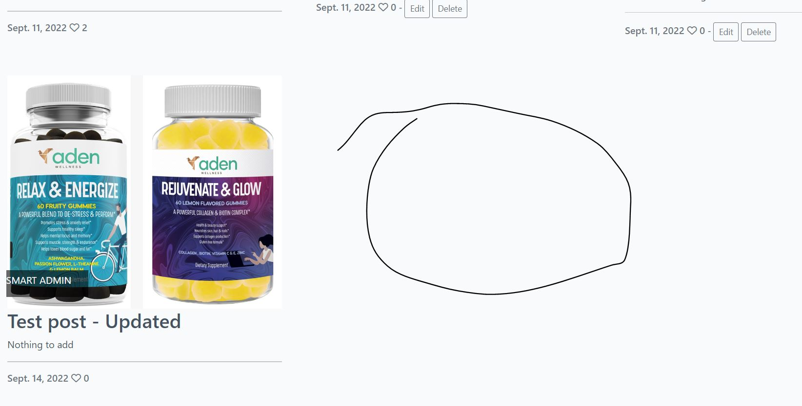

# DigitalZ Aden Testing

[Back to the README.md file](https://github.com/Zilvaro/digitalz-adenblog/blob/main/README.md)  

[Back to the Testing section in the README.md file](https://github.com/Zilvaro/digitalz-adenblog#testing)

[View the live website here](https://digitalz-adenwell.herokuapp.com/)  

## Table of Contents

1. [Testing User Stories](#testing-user-stories)
2. [Code Validation](#code-validation)
3. [Accessibility](#accessibility)
4. [Tools Testing](#tools-testing)
5. [Manual Testing](#manual-testing)

***

## Testing User Stories

### 1. As a **Site User** I can **register an account** so that **I can comment and like**

* A clear indication-link on the nav bar.

* Controlled form to fill-in data.

* Confirmation about signing-in and greeting.

* New-user data is visible and manageable in admin-backend.

### 2. As a **Site User** I can **view a list of posts** so that **I can select one to read**

* 

### 3. As a **Site User** I can **click on a post** so that **I can read the full text**

* 

### 4. As a **Site User** I can **leave comments on a post** so that **I can be involved in the conversation**

* Leave comment.

* Waiting-for-approval message.

* Read comment in the conversation stream.

### 5. As a **Site User** I can **like or unlike a post** so that **I can interact with the content**

* 'like' post.            

* 'unlike' post. 

### 6. As a **Site User** I can **click on a content** so that **I can read more about the topic**

* 

### 7. As a **User / Admin** I can **view the number of likes on each post** so that **I can see which is the most popular or viral**

* 

### 8. As a **User / Admin** I can **view comments on an individual post** so that **I can read the conversation**

* 

### 9. As a **User-admin** I can **create, edit, and delete a) content & b) posts directly on app** so that **I can manage the content area without accessing admin module**

* As author user can access the content item he has created.

* User can edit multiple parameters in the Content-update form.

* User can press Update button to save changes.

* As author user can access the post he has created.     

* User can make changes in the Post-update form.

* User can see changes after pressing the update-button.

* As author user can chose to delete the post or content he has created.

* User is requested to confirm the choice to delete the post or content.

* User can see the post is deleted after pressing the delete-button.

### 10. As an ** Admin** I can **create draft content** so that **I can publish/ update or delete later** 

* The user can select DRAFT button to access the content drafts he has created.

* User sees his drafts with an option to edit them.

* User can edit draft and/or publish it.

* User can see the daft being publiched to the app.

### 11. As an ** Admin** I can **approve or disapprove comments** so that **I can filter out objectionable comments**

* 

### 12. As an ** Admin** I can **set the content width** so that **I can place different number of items on one row**

* User selects which content item to Edit to change share-of-screen width.

* User selects screen's width portion.               

* User checks if changes makes the content look better

### 13. As a **Site Admin** I can **assign the post position number**, so **I can place posts according to importance**

* User selects which content item to Edit and checks current position-number.

* User selects the new position-place for the content to be located.               

* User checks if changes are applied correctly

### 14. As an **Admin** I can **select the card height** so that **I can create better looking design**

* User selects which content item to Edit to change the height for screens larger than xs.

* User selects screen's height in px.               

* User checks if changes makes the content look better

### 15. As an **Admin** I can **select the card template** so that **I can create dynamic looking design**

* User selects template type: with image behind the text or on the side               

* User checks if changes makes the content look better

### 16. As a **User** I can **create a contact message** so that **I can express my opinion or ask to contact back**

* User selects to oper Contact page from top nav menu.

* User writes the message to...                           

* Admin sees the messages in the backend               

## Code Validation

### HTML

The [W3C Markup Validator](https://validator.w3.org/) service was used to validate the HTML code of the project in order to ensure there were no syntax errors.
 
W3C Markup Validator found the following errors concerning index.html.

The errors were solved by removing the aria-label attribute from the nav, as well as removing the invalid closing Div tag.

W3C Markup Validator also found a great amount of errors in pages with user input. However, I found those errors to be coming from the Summernote editor. See example below:

### CSS

[W3C CSS Validator](https://jigsaw.w3.org/css-validator/) service was used to validate the CSS code of the project in order to ensure there were no syntax errors. 

W3C CSS Validator found no errors or warnings on my CSS.

### Pyhton

Pylint was used continuously during the development process to analyze the Python code for programming errors.

[PEP8 online](http://pep8online.com/) was further used to validate the Python code to validate the Python code for PEP8 requirements. See below the validation results and the reviewed results. 

| Location | Errors / Warnings | Code Reviewed |
| --- | --- | --- |
| ./question/admin.py | No errors / warnings | |
| ./question/forms.py |  |  |
| ./question/models.py |  |  |
| ./question/urls.py |  |  |
| ./question/views.py |  |  |

### JavaScript

[JSHints JavaScript Code Quality Tool](https://jshint.com/) was used to validate the site's JavaScript code. 

No errors were found.

## Accessibility

Lighthouse in Chrome DevTools has been used to confirm that the colors and fonts being used throughout the website are easy to read and accessible. See reports in the table below:

### Lighthouse Reports

Page | Lighthouse Report |
| --- | --- |
| Index |  |
| About |  |
| Register |  |
| Login |  |
| Logout |  |
| Question Detail !|  |
| Ask Question |  |
| Leave Reply |  |
| Edit Question |  |
| Delete Question |  |
| Edit Reply |  |
| Delete Reply |  |

## Tools Testing

### [Chrome DevTools](https://developer.chrome.com/docs/devtools/)

Chrome DevTools was used during the development process to test, explore and modify HTML elements and CSS styles used in the project.

### Responsiveness

* [Am I Responsive?](http://ami.responsivedesign.is/#) was used to check responsiveness of the site pages across different devices.

* Chrome DevTools was used to test responsiveness in different screen sizes during the development process.

## Manual Testing

### Browser Compatibility

Browser | Outcome | Pass/Fail | 
--- | --- | --- |
Google Chrome | No appearance, responsiveness nor functionality issues.| Pass |
Safari | No appearance, responsiveness nor functionality issues. | Pass |
Mozilla Firefox | No responsiveness nor functionality issues.| Pass |
Microsoft Edge | No appearance, responsiveness nor functionality issues. | Pass |

### Device Compatibility

Device | Operative System |Outcome | Pass/Fail
--- | --- | --- | --- |
Dell Optiplex 7060 | Windows 11 | No appearance, responsiveness nor functionality issues. | Pass |
MacBook Pro 15" | macOS Big Sur | No appearance, responsiveness nor functionality issues. | Pass |
Dell Latitude 5300 | Windows 10 | No appearance, responsiveness nor functionality issues. | Pass |
iPad Pro 12.9" | iOS 15 | No appearance, responsiveness nor functionality issues. | Pass |
iPad Pro 10.5" | iOS 15 |No appearance, responsiveness nor functionality issues. | Pass |
iPhone XR | iOS 15 |No appearance, responsiveness nor functionality issues. | Pass |
iPhone 7 | iOS 15 |No appearance, responsiveness nor functionality issues. | Pass |

### Test Results

#### General

<table>
    <tr>
        <th colspan=2>Feature</th>
        <th>Users</th>
        <th>Test</th>
        <th>Outcome</th>
        <th>Pass/Fail</th>
    </tr>
    <tr>
        <td rowspan=14>Navigation Bar</td>
        <td rowspan=2>Main logo link</td>
        <td rowspan=2>All</td>
        <td>Functionality</td>
        <td>Clicking the link redirects to the Home page.</td>
        <td>Pass</td>
    </tr>
    <tr>
        <td>Style</td>
        <td>N/A</td>
        <td>N/A</td>
    </tr>
    <tr>
        <td rowspan=2>Home link</td>
        <td rowspan=2>All</td>
        <td>Functionality</td>
        <td>Clicking the link redirects to the Home page.</td>
        <td>Pass</td>
    </tr>
    <tr>
        <td>Style</td>
        <td>Hover effect working as expected.</td>
        <td>Pass</td>
    </tr>
    <tr>
        <td rowspan=2>About link</td>
        <td rowspan=2>All</td>
        <td>Functionality</td>
        <td>Clicking the link redirects to the About page.</td>
        <td>Pass</td>
    </tr>
    <tr>
        <td>Style</td>
        <td>Hover effect working as expected.</td>
        <td>Pass</td>
    </tr>
    <tr>
        <td rowspan=2>Register link</td>
        <td rowspan=2>Unregistered</td>
        <td>Functionality</td>
        <td>Clicking the link redirects to the Register page.</td>
        <td>Pass</td>
    </tr>
    <tr>
        <td>Style</td>
        <td>Hover effect working as expected.</td>
        <td>Pass</td>
    </tr>
    <tr>
        <td rowspan=2>Login link</td>
        <td rowspan=2>Unregistered</td>
        <td>Functionality</td>
        <td>Clicking the link redirects to the Login page.</td>
        <td>Pass</td>
    </tr>
    <tr>
        <td>Style</td>
        <td>Hover effect working as expected.</td>
        <td>Pass</td>
    </tr>
    <tr>
        <td rowspan=2>Logout link</td>
        <td rowspan=2>Registered</td>
        <td>Functionality</td>
        <td>Clicking the link redirects to the Logout page.</td>
        <td>Pass</td>
    </tr>
    <tr>
        <td>Style</td>
        <td>Hover effect working as expected.</td>
        <td>Pass</td>
    </tr>
    <tr>
        <td rowspan=2>Hamburger Menu button </td>
        <td rowspan=2>All</td>
        <td>Functionality</td>
        <td>Clicking the button toggle navigation menu.</td>
        <td>Pass</td>
    </tr>
    <tr>
        <td>Style</td>
        <td>Responsive navigation menu on smaller screens. Hover effect working as expected.</td>
        <td>Pass</td>
    </tr>
    <tr>
        <td rowspan=4>Search Bar</td>
        <td rowspan=2>Input field</td>
        <td rowspan=2>All</td>
        <td>Functionality</td>
        <td>Placeholder "Search Question" shows as expected. Text can be entered in the field.</td>
        <td>Pass</td>
    </tr>
    <tr>
        <td>Style</td>
        <td>Focus effect working as expected.</td>
        <td>Pass</td>
    </tr>
    <tr>
        <td rowspan=2>Search button</td>
        <td rowspan=2>All</td>
        <td>Functionality</td>
        <td>Clicking the link redirects to the Search Results page. Input text is being posted to the Search Results page correctly.</td>
        <td>Pass</td>
    </tr>
    <tr>
        <td>Style</td>
        <td>Hover effect working as expected.</td>
        <td>Pass</td>
    </tr>
    <tr>
        <td rowspan=10>Footer</td>
        <td rowspan=2>Logo link</td>
        <td rowspan=2>All</td>
        <td>Functionality</td>
        <td>Clicking the link redirects to the home page.</td>
        <td>Pass</td>
    </tr>
    <tr>
        <td>Style</td>
        <td>Hover effect working as expected.</td>
        <td>Pass</td>
    </tr>
    <tr>
        <td rowspan=2>Facebook icon</td>
        <td rowspan=2>All</td>
        <td>Functionality</td>
        <td>Clicking the link open Facebook page on a separate tab.</td>
        <td>Pass</td>
    </tr>
    <tr>
        <td>Style</td>
        <td>Hover effect working as expected.</td>
        <td>Pass</td>
    </tr>
    <tr>
        <td rowspan=2>Instagram icon</td>
        <td rowspan=2>All</td>
        <td>Functionality</td>
        <td>Clicking the link open Instagram page on a separate tab.</td>
        <td>Pass</td>
    </tr>
    <tr>
        <td>Style</td>
        <td>Hover effect working as expected.</td>
        <td>Pass</td>
    </tr>
    <tr>
        <td rowspan=2>Youtube icon</td>
        <td rowspan=2>All</td>
        <td>Functionality</td>
        <td>Clicking the link open Youtube page on a separate tab.</td>
        <td>Pass</td>
    </tr>
    <tr>
        <td>Style</td>
        <td>Hover effect working as expected.</td>
        <td>Pass</td>
    </tr>
    <tr>
        <td rowspan=2>Twitter icon</td>
        <td rowspan=2>All</td>
        <td>Functionality</td>
        <td>Clicking the link open Twitter page on a separate tab.</td>
        <td>Pass</td>
    </tr>
    <tr>
        <td>Style</td>
        <td>Hover effect working as expected.</td>
        <td>Pass</td>
    </tr>
</table>

#### Home Page 

<table>
    <tr>
        <th colspan=2>Feature</th>
        <th>Users</th>
        <th>Test</th>
        <th>Outcome</th>
        <th>Pass/Fail</th>
    </tr>
    <tr>
        <td rowspan=2>Page Buttons</td>
        <td rowspan=2>Ask Question button</td>
        <td rowspan=2>All</td>
        <td>Functionality</td>
        <td>Clicking the button redirects to the Ask Question page.</td>
        <td>Pass</td>
    </tr>
    <tr>
        <td>Style</td>
        <td>Hover effect working as expected.</td>
        <td>Pass</td>
    </tr>
    <tr>
        <td rowspan=12>Question</td>
        <td rowspan=2>Score</td>
        <td rowspan=2>All</td>
        <td>Functionality</td>
        <td>Score renders correctly.</td>
        <td>Pass</td>
    </tr>
    <tr>
        <td>Style</td>
        <td>N/A</td>
        <td>N/A</td>
    </tr>
    <tr>
        <td rowspan=2>Title link</td>
        <td rowspan=2>All</td>
        <td>Functionality</td>
        <td>Title renders correctly. Clicking the link redirects to Question Detail page for the correct question.</td>
        <td>Pass</td>
    </tr>
    <tr>
        <td>Style</td>
        <td>Hover effect working as expected.</td>
        <td>Pass</td>
    </tr>
    <tr>
        <td rowspan=2>Author</td>
        <td rowspan=2>All</td>
        <td>Functionality</td>
        <td>Author renders correctly.</td>
        <td>Pass</td>
    </tr>
    <tr>
        <td>Style</td>
        <td>N/A</td>
        <td>N/A</td>
    </tr>
    <tr>
        <td rowspan=2>Last updated</td>
        <td rowspan=2>All</td>
        <td>Functionality</td>
        <td>Date and time when the question was created display correctly.</td>
        <td>Pass</td>
    </tr>
    <tr>
        <td>Style</td>
        <td>N/A</td>
        <td>N/A</td>
    </tr>
    <tr>
        <td rowspan=2>Edit Question button</td>
        <td rowspan=2>Registered</td>
        <td>Functionality</td>
        <td>Clicking the button redirects to Edit Question page for the correct question.</td>
        <td>Pass</td>
    </tr>
    <tr>
        <td>Style</td>
        <td>Hover effect working as expected.</td>
        <td>Pass</td>
    </tr>
    <tr>
        <td rowspan=2>Delete Question button</td>
        <td rowspan=2>Registered</td>
        <td>Functionality</td>
        <td>Clicking the button redirects to Delete Question page for the correct question.</td>
        <td>Pass</td>
    </tr>
    <tr>
        <td>Style</td>
        <td>Hover effect working as expected.</td>
        <td>Pass</td>
    </tr>
    <tr>
        <td rowspan=4>Voting</td>
        <td rowspan=2>Upvote button</td>
        <td rowspan=2>Registered</td>
        <td>Functionality</td>
        <td>Clicking the button toggle the user's upvote. Score is updated by 1.</td>
        <td>Pass</td>
    </tr>
    <tr>
        <td>Style</td>
        <td>Hover effect working as expected. Button selection is not working correctly. Button stay selected/unselected for all users and not only for the current user.</td>
        <td>Fail</td>
    </tr>
    <tr>
        <td rowspan=2>Downvote button</td>
        <td rowspan=2>Registered</td>
        <td>Functionality</td>
        <td>Clicking the button toggle the user's upvote. Score is updated by -1.</td>
        <td>Pass</td>
    </tr>
    <tr>
        <td>Style</td>
        <td>Hover effect working as expected. Button selection is not working correctly. Button stay selected/unselected for all users and not only for the current user.</td>
        <td>Fail</td>
    </tr>
    <tr>
        <td rowspan=4>Site Pagination</td>
        <td rowspan=2>Pagination</td>
        <td rowspan=2>All</td>
        <td>Functionality</td>
        <td>Pagination occurs if more than 10 questions are listed.</td>
        <td>Pass</td>
    </tr>
    <tr>
        <td>Style</td>
        <td>N/A</td>
        <td>N/A</td>
    </tr>
    <tr>
        <td rowspan=2>Pagination Buttons</td>
        <td rowspan=2>All</td>
        <td>Functionality</td>
        <td>Clicking the buttons navigate back and forth between the pages.</td>
        <td>Pass</td>
    </tr>
    <tr>
        <td>Style</td>
        <td>Hover effect working as expected.</td>
        <td>Pass</td>
    </tr>
</table>

#### About Page 

<table>
    <tr>
        <th>Feature</th>
        <th>Users</th>
        <th>Test</th>
        <th>Outcome</th>
        <th>Pass/Fail</th>
    </tr>
    <tr>
        <td rowspan=2>General</td>
        <td rowspan=2>All</td>
        <td>Functionality</td>
        <td>About page render correctly</td>
        <td>Pass</td>
    </tr>
    <tr>
        <td>Style</td>
        <td>General styling</td>
        <td>Pass</td>
    </tr>
</table>

#### Search Results Page

<table>
    <tr>
        <th colspan=2>Feature</th>
        <th>Users</th>
        <th>Test</th>
        <th>Outcome</th>
        <th>Pass/Fail</th>
    </tr>
    <tr>
        <td rowspan=2>General</td>
        <td rowspan=2>Main Title</td>
        <td rowspan=2>All</td>
        <td>Functionality</td>
        <td>Title display correct information depending on the results.</td>
        <td>Pass</td>
    </tr>
    <tr>
        <td>Style</td>
        <td>N/A</td>
        <td>N/A</td>
    </tr>
    <tr>
        <td rowspan=12>Question</td>
        <td rowspan=2>Score</td>
        <td rowspan=2>All</td>
        <td>Functionality</td>
        <td>Score renders correctly.</td>
        <td>Pass</td>
    </tr>
    <tr>
        <td>Style</td>
        <td>N/A</td>
        <td>N/A</td>
    </tr>
    <tr>
        <td rowspan=2>Title link</td>
        <td rowspan=2>All</td>
        <td>Functionality</td>
        <td>Title renders correctly. Clicking the link redirects to Question Detail page for the correct question.</td>
        <td>Pass</td>
    </tr>
    <tr>
        <td>Style</td>
        <td>Hover effect working as expected.</td>
        <td>Pass</td>
    </tr>
    <tr>
        <td rowspan=2>Author</td>
        <td rowspan=2>All</td>
        <td>Functionality</td>
        <td>Author renders correctly.</td>
        <td>Pass</td>
    </tr>
    <tr>
        <td>Style</td>
        <td>N/A</td>
        <td>N/A</td>
    </tr>
    <tr>
        <td rowspan=2>Last updated</td>
        <td rowspan=2>All</td>
        <td>Functionality</td>
        <td>Date and time when the question was created display correctly.</td>
        <td>Pass</td>
    </tr>
    <tr>
        <td>Style</td>
        <td>N/A</td>
        <td>N/A</td>
    </tr>
    <tr>
        <td rowspan=2>Edit Question button</td>
        <td rowspan=2>Registered</td>
        <td>Functionality</td>
        <td>Clicking the button redirects to Edit Question page for the correct question.</td>
        <td>Pass</td>
    </tr>
    <tr>
        <td>Style</td>
        <td>Hover effect working as expected.</td>
        <td>Pass</td>
    </tr>
    <tr>
        <td rowspan=2>Delete Question button</td>
        <td rowspan=2>Registered</td>
        <td>Functionality</td>
        <td>Clicking the button redirects to Delete Question page for the correct question.</td>
        <td>Pass</td>
    </tr>
    <tr>
        <td>Style</td>
        <td>Hover effect working as expected.</td>
        <td>Pass</td>
    </tr>
    <tr>
        <td rowspan=4>Site Pagination</td>
        <td rowspan=2>Pagination</td>
        <td rowspan=2>All</td>
        <td>Functionality</td>
        <td>Pagination is not occurring if more than 10 questions are listed.</td>
        <td>Fail</td>
    </tr>
    <tr>
        <td>Style</td>
        <td>N/A</td>
        <td>N/A</td>
    </tr>
    <tr>
        <td rowspan=2>Pagination Buttons</td>
        <td rowspan=2>All</td>
        <td>Functionality</td>
        <td>N/A</td>
        <td>N/A</td>
    </tr>
    <tr>
        <td>Style</td>
        <td>N/A</td>
        <td>N/A</td>
    </tr>
</table>

#### Question Detail Page

<table>
    <tr>
        <th colspan=2>Feature</th>
        <th>Users</th>
        <th>Test</th>
        <th>Outcome</th>
        <th>Pass/Fail</th>
    </tr>
    <tr>
        <td rowspan=2>Page Buttons</td>
        <td rowspan=2>Reply Question button</td>
        <td rowspan=2>All</td>
        <td>Functionality</td>
        <td>Clicking the button redirects to the Reply Question page.</td>
        <td>Pass</td>
    </tr>
    <tr>
        <td>Style</td>
        <td>Hover effect working as expected.</td>
        <td>Pass</td>
    </tr>
    <tr>
        <td rowspan=14>Question</td>
        <td rowspan=2>Score</td>
        <td rowspan=2>All</td>
        <td>Functionality</td>
        <td>Score renders correctly.</td>
        <td>Pass</td>
    </tr>
    <tr>
        <td>Style</td>
        <td>N/A</td>
        <td>N/A</td>
    </tr>
    <tr>
        <td rowspan=2>Title</td>
        <td rowspan=2>All</td>
        <td>Functionality</td>
        <td>Title renders correctly.</td>
        <td>Pass</td>
    </tr>
    <tr>
        <td>Style</td>
        <td>N/A</td>
        <td>N/A</td>
    </tr>
    <tr>
        <td rowspan=2>Author</td>
        <td rowspan=2>All</td>
        <td>Functionality</td>
        <td>Author renders correctly.</td>
        <td>Pass</td>
    </tr>
    <tr>
        <td>Style</td>
        <td>N/A</td>
        <td>N/A</td>
    </tr>
    <tr>
        <td rowspan=2>Content</td>
        <td rowspan=2>All</td>
        <td>Functionality</td>
        <td>Content renders correctly.</td>
        <td>Pass</td>
    </tr>
    <tr>
        <td>Style</td>
        <td>N/A</td>
        <td>N/A</td>
    </tr>
    <tr>
        <td rowspan=2>Last updated</td>
        <td rowspan=2>All</td>
        <td>Functionality</td>
        <td>Date and time when the question was created display correctly.</td>
        <td>Pass</td>
    </tr>
    <tr>
        <td>Style</td>
        <td>N/A</td>
        <td>N/A</td>
    </tr>
    <tr>
        <td rowspan=2>Edit Question button</td>
        <td rowspan=2>Registered</td>
        <td>Functionality</td>
        <td>Clicking the button redirects to Edit Question page for the correct question.</td>
        <td>Pass</td>
    </tr>
    <tr>
        <td>Style</td>
        <td>Hover effect working as expected.</td>
        <td>Pass</td>
    </tr>
    <tr>
        <td rowspan=2>Delete Question button</td>
        <td rowspan=2>Registered</td>
        <td>Functionality</td>
        <td>Clicking the button redirects to Delete Question page for the correct question.</td>
        <td>Pass</td>
    </tr>
    <tr>
        <td>Style</td>
        <td>Hover effect working as expected.</td>
        <td>Pass</td>
    </tr>
        <tr>
        <td rowspan=12>Reply</td>
        <td rowspan=2>Score</td>
        <td rowspan=2>All</td>
        <td>Functionality</td>
        <td>Score renders correctly.</td>
        <td>Pass</td>
    </tr>
    <tr>
        <td>Style</td>
        <td>N/A</td>
        <td>N/A</td>
    </tr>
    <tr>
        <td rowspan=2>Body</td>
        <td rowspan=2>All</td>
        <td>Functionality</td>
        <td>Body renders correctly.</td>
        <td>Pass</td>
    </tr>
    <tr>
        <td>Style</td>
        <td>N/A</td>
        <td>N/A</td>
    </tr>
    <tr>
        <td rowspan=2>Author</td>
        <td rowspan=2>All</td>
        <td>Functionality</td>
        <td>Author renders correctly.</td>
        <td>Pass</td>
    </tr>
    <tr>
        <td>Style</td>
        <td>N/A</td>
        <td>N/A</td>
    </tr>
    <tr>
        <td rowspan=2>Last updated</td>
        <td rowspan=2>All</td>
        <td>Functionality</td>
        <td>Date and time when the question was created display correctly.</td>
        <td>Pass</td>
    </tr>
    <tr>
        <td>Style</td>
        <td>N/A</td>
        <td>N/A</td>
    </tr>
    <tr>
        <td rowspan=2>Edit Reply button</td>
        <td rowspan=2>Registered</td>
        <td>Functionality</td>
        <td>Clicking the button redirects to Edit Reply page for the correct reply.</td>
        <td>Pass</td>
    </tr>
    <tr>
        <td>Style</td>
        <td>Hover effect working as expected.</td>
        <td>Pass</td>
    </tr>
    <tr>
        <td rowspan=2>Delete Reply button</td>
        <td rowspan=2>Registered</td>
        <td>Functionality</td>
        <td>Clicking the button redirects to Delete Reply page for the correct reply.</td>
        <td>Pass</td>
    </tr>
    <tr>
        <td>Style</td>
        <td>Hover effect working as expected.</td>
        <td>Pass</td>
    </tr>
    <tr>
        <td rowspan=8>Voting</td>
        <td rowspan=2>Queston Upvote button</td>
        <td rowspan=2>Registered</td>
        <td>Functionality</td>
        <td>Clicking the button toggle the user's upvote. Score is updated by 1.</td>
        <td>Pass</td>
    </tr>
    <tr>
        <td>Style</td>
        <td>Hover effect working as expected. Button selection is not working correctly. Button stay selected/unselected for all users and not only for the current user.</td>
        <td>Fail</td>
    </tr>
    <tr>
        <td rowspan=2>Question Downvote button</td>
        <td rowspan=2>Registered</td>
        <td>Functionality</td>
        <td>Clicking the button toggle the user's upvote. Score is updated by -1.</td>
        <td>Pass</td>
    </tr>
    <tr>
        <td>Style</td>
        <td>Hover effect working as expected. Button selection is not working correctly. Button stay selected/unselected for all users and not only for the current user.</td>
        <td>Fail</td>
    </tr>
    <tr>
        <td rowspan=2>Reply Upvote button</td>
        <td rowspan=2>Registered</td>
        <td>Functionality</td>
        <td>Clicking the button toggle the user's upvote. Score is updated by 1.</td>
        <td>Pass</td>
    </tr>
    <tr>
        <td>Style</td>
        <td>Hover effect working as expected. Button selection is not working correctly. Button stay selected/unselected for all users and not only for the current user.</td>
        <td>Fail</td>
    </tr>
    <tr>
        <td rowspan=2>Reply Downvote button</td>
        <td rowspan=2>Registered</td>
        <td>Functionality</td>
        <td>Clicking the button toggle the user's upvote. Score is updated by -1.</td>
        <td>Pass</td>
    </tr>
    <tr>
        <td>Style</td>
        <td>Hover effect working as expected. Button selection is not working correctly. Button stay selected/unselected for all users and not only for the current user.</td>
        <td>Fail</td>
    </tr>
</table>

#### Ask Question Page

<table>
    <tr>
        <th colspan=2>Feature</th>
        <th>Users</th>
        <th>Test</th>
        <th>Outcome</th>
        <th>Pass/Fail</th>
    </tr>
    <tr>
        <td rowspan=8>Question Form</td>
        <td rowspan=2>Title input</td>
        <td rowspan=2>Registered</td>
        <td>Functionality</td>
        <td>Text can be entered in the field. Validation occurs if field is left empty</td>
        <td>Pass</td>
    </tr>
    <tr>
        <td>Style</td>
        <td>Focus effect working as expected.</td>
        <td>Pass</td>
    </tr>
    <tr>
        <td rowspan=2>Content input</td>
        <td rowspan=2>Registered</td>
        <td>Functionality</td>
        <td>Summernote editor display correctly. Text can be entered in the field. Unable to validate when field is left empty. Unable to submit if this happens as form is invalid.</td>
        <td>Fail</td>
    </tr>
    <tr>
        <td>Style</td>
        <td>Styled correctly by Summernote CSS code.</td>
        <td>Pass</td>
    </tr>
    <tr>
        <td rowspan=2>Submit button</td>
        <td rowspan=2>Registered</td>
        <td>Functionality</td>
        <td>Clicking the button submit the form and redirects to the Home page. Submit question if valid. Display message if the form submits successfully or not.</td>
        <td>Pass</td>
    </tr>
    <tr>
        <td>Style</td>
        <td>Hover effect working as expected.</td>
        <td>Pass</td>
    </tr>
    <tr>
        <td rowspan=2>Cancel button</td>
        <td rowspan=2>Registered</td>
        <td>Functionality</td>
        <td>Clicking the button redirects to the Home page.</td>
        <td>Pass</td>
    </tr>
    <tr>
        <td>Style</td>
        <td>Hover effect working as expected.</td>
        <td>Pass</td>
    </tr>
</table>

#### Leave Reply Page

<table>
    <tr>
        <th colspan=2>Feature</th>
        <th>Users</th>
        <th>Test</th>
        <th>Outcome</th>
        <th>Pass/Fail</th>
    </tr>
    <tr>
        <td rowspan=6>Reply Form</td>
        <td rowspan=2>Body input</td>
        <td rowspan=2>Registered</td>
        <td>Functionality</td>
        <td>Summernote editor display correctly. Text can be entered in the field. Unable to validate when field is left empty. Unable to submit if this happens as form is invalid.</td>
        <td>Fail</td>
    </tr>
    <tr>
        <td>Style</td>
        <td>Styled correctly by Summernote CSS code.</td>
        <td>Pass</td>
    </tr>
    <tr>
        <td rowspan=2>Submit button</td>
        <td rowspan=2>Registered</td>
        <td>Functionality</td>
        <td>Clicking the button submit the form and redirects to the originating page. Submit question if valid. Display message if the form submits successfully or not</td>
        <td>Pass</td>
    </tr>
    <tr>
        <td>Style</td>
        <td>Hover effect working as expected.</td>
        <td>Pass</td>
    </tr>
    <tr>
        <td rowspan=2>Cancel button</td>
        <td rowspan=2>Registered</td>
        <td>Functionality</td>
        <td>Clicking the button redirects to the Home page.</td>
        <td>Pass</td>
    </tr>
    <tr>
        <td>Style</td>
        <td>Hover effect working as expected.</td>
        <td>Pass</td>
    </tr>
</table>

#### Edit Question Page

<table>
    <tr>
        <th colspan=2>Feature</th>
        <th>Users</th>
        <th>Test</th>
        <th>Outcome</th>
        <th>Pass/Fail</th>
    </tr>
    <tr>
        <td rowspan=6>Question Form</td>
        <td rowspan=2>Title input</td>
        <td rowspan=2>All</td>
        <td>Functionality</td>
        <td> Text in the field is being prepopulated correctly. Text can be edited. Validation occurs if field is left empty</td>
        <td>Pass</td>
    </tr>
    <tr>
        <td>Style</td>
        <td>Focus effect working as expected.</td>
        <td>Pass</td>
    </tr>
    <tr>
        <td rowspan=2>Content input</td>
        <td rowspan=2>Registered</td>
        <td>Functionality</td>
        <td>Summernote editor display correctly. Text in the field is being prepopulated correctly. Text can be edited. Unable to validate when field is left empty. Unable to submit if this happens as form is invalid.</td>
        <td>Fail</td>
    </tr>
    <tr>
        <td>Style</td>
        <td>Styled correctly by Summernote CSS code.</td>
        <td>Pass</td>
    </tr>
    <tr>
        <td rowspan=2>Submit button</td>
        <td rowspan=2>Registered</td>
        <td>Functionality</td>
        <td>Clicking the button submit the form and redirects to the Home page. Edit question if form is valid. Display message if the question is edit successfully or not.</td>
        <td>Pass</td>
    </tr>
    <tr>
        <td>Style</td>
        <td>Hover effect working as expected.</td>
        <td>Pass</td>
    </tr>
</table>

#### Delete Question Page

<table>
    <tr>
        <th colspan=2>Feature</th>
        <th>Users</th>
        <th>Test</th>
        <th>Outcome</th>
        <th>Pass/Fail</th>
    </tr>
    <tr>
    <tr>
        <td rowspan=6>Delete Form</td>
        <td rowspan=2>Question Title</td>
        <td rowspan=2>Registered</td>
        <td>Functionality</td>
        <td>Question title renders correctly.</td>
        <td>Pass</td>
    </tr>
    <tr>
        <td>Style</td>
        <td>N/A</td>
        <td>N/A</td>
    </tr>
    <tr>
        <td rowspan=2>Yes button</td>
        <td rowspan=2>Registered</td>
        <td>Functionality</td>
        <td>Clicking the button submit the form and redirects to the Home page. Question get deleted. Display message if the question is deleted successfully or not.</td>
        <td>Pass</td>
    </tr>
    <tr>
        <td>Style</td>
        <td>Hover effect working as expected.</td>
        <td>Pass</td>
    </tr>
    <tr>
        <td rowspan=2>No button</td>
        <td rowspan=2>Registered</td>
        <td>Functionality</td>
        <td>Clicking the button redirects to the Home page without deleting the question.</td>
        <td>Pass</td>
    </tr>
    <tr>
        <td>Style</td>
        <td>Hover effect working as expected.</td>
        <td>Pass</td>
    </tr>
</table>

#### Edit Reply Page

<table>
    <tr>
        <th colspan=2>Feature</th>
        <th>Users</th>
        <th>Test</th>
        <th>Outcome</th>
        <th>Pass/Fail</th>
    </tr>
    <tr>
        <td rowspan=4>Reply Form</td>
        <td rowspan=2>Content input</td>
        <td rowspan=2>Registered</td>
        <td>Functionality</td>
        <td>Summernote editor display correctly. Text in the field is being prepopulated correctly. Text can be edited. Unable to validate when field is left empty. Unable to submit if this happens as form is invalid.</td>
        <td>Fail</td>
    </tr>
    <tr>
        <td>Style</td>
        <td>Styled correctly by Summernote CSS code.</td>
        <td>Pass</td>
    </tr>
    <tr>
        <td rowspan=2>Submit button</td>
        <td rowspan=2>Registered</td>
        <td>Functionality</td>
        <td>Clicking the button submit the form and redirects to the originating page. Edit question if form is valid. Display message if the reply is edit successfully or not.</td>
        <td>Pass</td>
    </tr>
    <tr>
        <td>Style</td>
        <td>Hover effect working as expected.</td>
        <td>Pass</td>
    </tr>
</table>

#### Delete Reply Page

<table>
    <tr>
        <th colspan=2>Feature</th>
        <th>Users</th>
        <th>Test</th>
        <th>Outcome</th>
        <th>Pass/Fail</th>
    </tr>
    <tr>
        <td rowspan=4>Delete Form</td>
        <td rowspan=2>Yes button</td>
        <td rowspan=2>Registered</td>
        <td>Functionality</td>
        <td>Clicking the button submit the form and redirects to the originating page. Reply gets deleted. Display message if the reply is deleted successfully or not.</td>
        <td>Pass</td>
    </tr>
    <tr>
        <td>Style</td>
        <td>Hover effect working as expected.</td>
        <td>Pass</td>
    </tr>
    <tr>
        <td rowspan=2>No button</td>
        <td rowspan=2>Registered</td>
        <td>Functionality</td>
        <td>Clicking the redirects to the originating page without deleting the reply.</td>
        <td>Pass</td>
    </tr>
    <tr>
        <td>Style</td>
        <td>Hover effect working as expected.</td>
        <td>Pass</td>
    </tr>
</table>

#### Sign Up Page

<table>
    <tr>
        <th colspan=2>Feature</th>
        <th>Users</th>
        <th>Test</th>
        <th>Outcome</th>
        <th>Pass/Fail</th>
    </tr>
    <tr>
        <td rowspan=10>Sign Up Form</td>
        <td rowspan=2>Username input</td>
        <td rowspan=2>All</td>
        <td>Functionality</td>
        <td>Text can be entered in the field. Field validates input to be present. Display message if the username already exists.</td>
        <td>Pass</td>
    </tr>
    <tr>
        <td>Style</td>
        <td>Focus effect working as expected.</td>
        <td>Pass</td>
    </tr>
    <tr>
        <td rowspan=2>E-mail input</td>
        <td rowspan=2>All</td>
        <td>Functionality</td>
        <td>Text can be entered in the field. Optional field. Allow to be left empty Validate input is an email address. Display message if the e-mail already exists.</td>
        <td>Pass</td>
    </tr>
    <tr>
        <td>Style</td>
        <td>Focus effect working as expected.</td>
        <td>Pass</td>
    </tr>
    <tr>
        <td rowspan=2>Password input</td>
        <td rowspan=2>All</td>
        <td>Functionality</td>
        <td>Text can be entered in the field. Field validates input to be present. Validate input is a valid password. Display message if password is not valid. Display message if both passwords are not equal.</td>
        <td>Pass</td>
    </tr>
    <tr>
        <td>Style</td>
        <td>Focus effect working as expected.</td>
        <td>Pass</td>
    </tr>
    <tr>
        <td rowspan=2>Password Repeat input</td>
        <td rowspan=2>All</td>
        <td>Functionality</td>
        <td>Text can be entered in the field. Field validates input to be present. Validate input is a valid password Display message if password is not valid Display message if both passwords are not equal</td>
        <td>Pass</td>
    </tr>
    <tr>
        <td>Style</td>
        <td>Focus effect working as expected.</td>
        <td>Pass</td>
    </tr>
    <tr>
        <td rowspan=2>Sign Up button</td>
        <td rowspan=2>All</td>
        <td>Functionality</td>
        <td>Clicking the button submit the form and redirects to the Home page. Create user if form is valid. Display message if user is successfully created.</td>
        <td>Pass</td>
    </tr>
    <tr>
        <td>Style</td>
        <td>Hover effect working as expected.</td>
        <td>Pass</td>
    </tr>
</table>

#### Login Page

<table>
    <tr>
        <th colspan=2>Feature</th>
        <th>Users</th>
        <th>Test</th>
        <th>Outcome</th>
        <th>Pass/Fail</th>
    </tr>
    <tr>
        <td rowspan=6>Sign In Form</td>
        <td rowspan=2>Username input</td>
        <td rowspan=2>All</td>
        <td>Functionality</td>
        <td>Text can be entered in the field. Field validates input to be present. Display message if the username doesn't exists.</td>
        <td>Pass</td>
    </tr>
    <tr>
        <td>Style</td>
        <td>Focus effect working as expected.</td>
        <td>Pass</td>
    </tr>
    <tr>
        <td rowspan=2>Password input</td>
        <td rowspan=2>All</td>
        <td>Functionality</td>
        <td>Text can be entered in the field. Field validates input to be present. Display message if password is not valid.</td>
        <td>Pass</td>
    </tr>
    <tr>
        <td>Style</td>
        <td>Focus effect working as expected.</td>
        <td>Pass</td>
    </tr>
    <tr>
        <td rowspan=2>Sign In button</td>
        <td rowspan=2>All</td>
        <td>Functionality</td>
        <td>Clicking the button authenticates the user and redirect to the Home page. Display message if credentials are not valid. Display message if user login successfully.</td>
        <td>Pass</td>
    </tr>
    <tr>
        <td>Style</td>
        <td>Hover effect working as expected.</td>
        <td>Pass</td>
    </tr>
</table>

#### Logout Page

<table>
    <tr>
        <th colspan=2>Feature</th>
        <th>Users</th>
        <th>Test</th>
        <th>Outcome</th>
        <th>Pass/Fail</th>
    </tr>
    <tr>
        <td rowspan=2>Sign Out Form</td>
        <td rowspan=2>Submit button</td>
        <td rowspan=2>All</td>
        <td>Functionality</td>
        <td>Clicking the button sign out the user and redirect to the Home page. Display message if user logout successfully.</td>
        <td>Pass</td>
    </tr>
    <tr>
        <td>Style</td>
        <td>Hover effect working as expected.</td>
        <td>Pass</td>
    </tr>
</table>